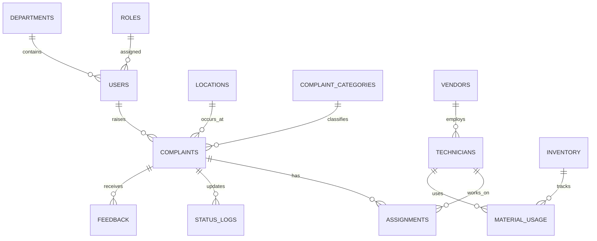

# Smart Campus Service & Maintenance Management System

## Gautam Buddha University

---

## 1. Project Overview

Gautam Buddha University operates a large and geographically distributed campus consisting of academic blocks, hostels, residential quarters, administrative offices, sports facilities, auditoriums, guest houses, and commercial areas. Managing maintenance and service operations across such a vast ecosystem using manual and fragmented processes results in inefficiencies, delays, and lack of accountability.

The **Smart Campus Service & Maintenance Management System** is proposed as a centralized digital platform inspired by the Urban Company service aggregation model, adapted specifically for a university environment. The system will automate service request handling, technician assignment, monitoring, inventory usage, and analytics through role-based dashboards.

---

## 2. Problem Statement

The current campus service management system faces the following issues:

* Manual complaint registration via phone calls or paper forms
* No centralized tracking or monitoring system
* Delayed response and resolution times
* Poor coordination between departments, vendors, and technicians
* Inefficient use of manpower and materials
* No analytics for performance evaluation or predictive maintenance

A scalable, technology-driven solution is required to ensure transparency, efficiency, and accountability in campus operations.

---

## 3. Objectives

* Provide a single unified digital platform for all campus services
* Enable online complaint registration and real-time tracking
* Optimize technician and vendor resource allocation
* Improve response time and service quality
* Maintain complete service history and audit trails
* Support data-driven decision making through analytics

---

## 4. Technology Stack

* **Frontend:** React.js (Web + PWA)
* **Backend:** PHP (RESTful APIs)
* **Database:** MySQL (Relational Database)
* **Authentication:** JWT / Session-based
* **Hosting:** Cloud / University Server

---

## 5. System Architecture (Layered Architecture)

The Smart Campus Service & Maintenance Management System follows a **layered, modular, and scalable architecture**. Each layer has a clearly defined responsibility, enabling maintainability, security, and future extensibility.

---

### 5.1 Presentation Layer

This layer represents the **user-facing interfaces** of the system.

**Components:**

* **Web Portal**

  * Admin Dashboard
  * Vendor Dashboard
  * Department Supervisor Dashboard
* **Mobile / Web App (PWA)**

  * Students
  * Faculty & Staff
  * Technicians

**Responsibilities:**

* User interaction and data input
* Role-based UI rendering
* Dashboard visualization
* Form validation
* API consumption

**Technologies:**

* React.js
* HTML5, CSS3, JavaScript
* Responsive & Mobile-first Design

---

### 5.2 Application Layer

This is the **core business logic layer** of the system. All rules, workflows, and decision-making processes are handled here.

**Modules:**

* **Complaint Management Service**

  * Complaint registration
  * Status updates
  * Priority handling

* **CRM & Workflow Engine**

  * Complaint lifecycle management
  * Approval and escalation flows

* **Technician Allocation Engine**

  * Skill-based technician mapping
  * Availability-based assignment

* **Feedback & Rating Engine**

  * User feedback collection
  * Technician and vendor ratings

* **Notification & Escalation Engine**

  * Automated alerts
  * SLA-based escalation

* **Analytics & Reporting Engine**

  * Performance metrics
  * Usage trends
  * Decision support reports

**Technologies:**

* PHP (REST APIs)
* Business Logic Services

---

### 5.3 Integration Layer

This layer allows the system to **communicate with external services and smart infrastructure**.

**Integrations:**

* **IoT Sensor Gateway**

  * Water leakage detection
  * Power consumption monitoring
  * HVAC fault alerts

* **GIS & Map Services**

  * Campus location mapping
  * Complaint heatmaps

* **Communication Services**

  * SMS API
  * Email Services
  * WhatsApp Notifications

**Purpose:**

* Enable real-time monitoring
* Support smart campus capabilities
* Improve response time

---

### 5.4 Data Layer

The Data Layer is responsible for **data storage, integrity, and retrieval**.

**Databases:**

* **Centralized Campus Service Database**

  * Users
  * Complaints
  * Assignments
  * Inventory

* **Feedback Database (Role-Segregated)**

  * Student feedback
  * Staff feedback
  * Technician ratings

* **Logs & Audit Database**

  * User activity logs
  * System events
  * Security audits

**Characteristics:**

* Relational database model
* Foreign key constraints
* Transaction management

---

### 5.5 Security Layer

The Security Layer ensures **data protection, access control, and system integrity**.

**Security Mechanisms:**

* **Role-Based Access Control (RBAC)**

  * Role-specific permissions

* **Authentication**

  * Secure login mechanisms
  * Token/session-based access

* **Authorization**

  * API-level access checks

* **Encryption**

  * Password hashing
  * Secure data transmission

---

## 6. User Roles & Dashboards

### 6.1 Student / Staff Dashboard

* Raise service requests
* Select category, location, and priority
* Upload images/videos
* Track real-time status
* View complaint history
* Provide feedback and ratings

### 6.2 Technician Dashboard

* View assigned jobs
* Accept / reject tasks
* Update work status
* Upload completion proof
* Mark material usage
* View work history

### 6.3 Vendor Dashboard

* Manage technicians
* Assign jobs
* Monitor SLA compliance
* Track invoices and payments
* View performance analytics

### 6.4 Department Admin Dashboard

* Monitor area-specific complaints
* Approve or escalate requests
* Change priority levels
* Generate department reports

### 6.5 Central Campus Admin Dashboard (Smart Campus CRM)

* View all campus complaints
* Manage vendors and technicians
* Monitor SLA and response times
* View analytics and reports
* Resource planning

### 6.6 Inventory / Store Dashboard

* Manage material stock
* Issue materials to technicians
* Low stock alerts
* Track material usage

### 6.7 Super Admin Dashboard

* User and role management
* Permission control
* System configuration
* Audit logs and backups

---

## 7. Functional Requirements

* User authentication and authorization
* Role-based access control (RBAC)
* Online complaint registration
* Technician assignment workflow
* Status tracking and notifications
* Feedback and rating system
* Inventory and material tracking
* Analytics and reporting

---

## 8. Non-Functional Requirements

* Responsive and mobile-first UI
* Secure data handling
* Scalable and modular architecture
* High availability and reliability
* Easy usability and accessibility

---

## 9. Database Design

### 9.1 Core Tables

* users
* roles
* departments
* locations
* complaints
* complaint_categories
* technicians
* vendors
* assignments
* status_logs
* inventory
* material_usage
* feedback
* notifications

---

## 10. ER Diagram (Mermaid Format)

---

## 11. Sample Table Structure (High Level)

### users

* id (PK)
* name
* email
* phone
* role_id (FK)
* department_id (FK)

### complaints

* id (PK)
* user_id (FK)
* category_id (FK)
* location_id (FK)
* priority
* description
* status
* created_at

### technicians

* id (PK)
* vendor_id (FK)
* skill_type
* availability_status

---

## 12. Development Roadmap

### Phase 1: Frontend

* Role-based UI design
* Dashboard layouts
* Static data integration

### Phase 2: Backend

* API development
* Database integration
* Authentication

### Phase 3: Advanced Features

* Analytics dashboards
* Reports
* Predictive maintenance

---

## 13. Expected Outcomes

* Reduced service resolution time
* Improved transparency
* Efficient resource utilization
* Better campus experience
* Data-driven administration

---

## 14. Future Enhancements

* IoT-based fault detection
* AI-based predictive maintenance
* Mobile app with push notifications
* GIS-based campus mapping

---

## 15. Conclusion

The Smart Campus Service & Maintenance Management System will serve as a unified digital backbone for Gautam Buddha University, transforming traditional manual processes into a smart, efficient, transparent, and scalable system aligned with modern digital governance principles.
